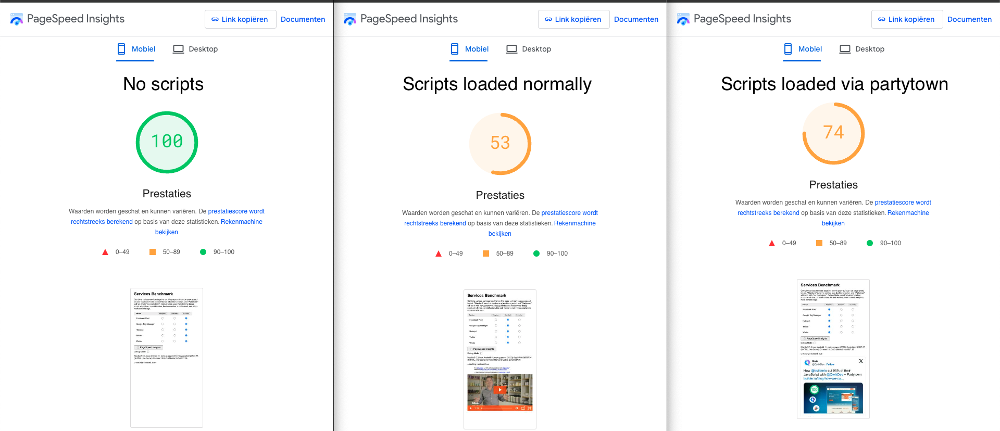

# Statamic partytown

Scripts like GTM have a massive negative impact on performance and pagespeed, to remedy this scripts like [Partytown](https://partytown.builder.io/) have been made.
Which allows you to keep your analytics but reclaim _some_ of the performance.



## Installation

 - Install using `composer require justbetter/statamic-partytown`
 - Execute `yarn add @builder.io/partytown`
 - [Configure Vite (or your other compiler) to copy the partytown files](https://partytown.builder.io/copy-library-files#vite) (however instead of dist it should go in public)
 - Add `/public/~partytown` to your .gitignore

### Load Partytown in on your head

If you're using antlers you should add the following to your head
```antlers
<head>
    ...
    {{ partial:if_exists src="statamic-partytown::head" }}
    ...
</head>
```
and in case of blade you can include it using the following
```blade
<head>
    ...
    @include('statamic-partytown::head')
    ...
</head>
```

### Optional

If you want to manage and add scripts to the page with partytown outside of your own built templates you can publish the Partytown Settings global:

```bash
php artisan vendor:publish --provider="JustBetter\StatamicPartytown\ServiceProvider" --tag=statamic-content
```

## Usage

Partytown is running by default **if** you are running your site on https.

To use Partytown simply change the scripts you want to run in partytown from `<script type="text/javascript">` or `<script>` into `<script type="text/partytown>`

And they will be executed within Partytown.

If you've published the statamic global you can also paste your script snippets into the config and enable partytown for the snippet.

## Additional domains and CORS

Not all domains support partytown due to their CORS settings (https://partytown.builder.io/proxying-requests)
This package comes with a proxy for these domains which by default has some domains already added (see: config/statamic/partytown.php)
If you notice more domains giving CORS errors you can add them to the config or in a comma seperated list in your .env under `GTM_PARTYTOWN_DOMAIN_WHITELIST`.

## Custom config

The partytown configuration is available in `window.partytown` so you can change the configuration by updating the configuration within `<script></script>` tags.

See: [https://partytown.builder.io/configuration](https://partytown.builder.io/configuration)
